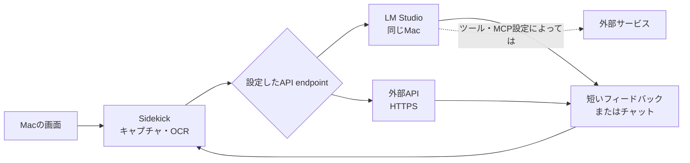

# Sidekick

[English README](README.md)

`Sidekick` は、Macで見ている画面に合わせて短いアドバイスやリアクションを返すデスクトップアシスタントです。エラーが見えたら次の一手を提案し、動画やゲームでは一緒に見ている相手のようにコメントします。気になった返答は、その画面の文脈を引き継いでチャットできます。


## できること

- **作業の詰まりを見つける:** コードのエラーや設定画面を読み取り、次に確認できそうなことを短く提案します。
- **動画やゲームを一緒に楽しむ:** リアクション、背景知識、小ネタを画面のすみに表示します。
- **必要なときだけ反応する:** 画面の変化が小さい間は静かに待機し、反応の頻度や口調も調整できます。
- **そのまま詳しく聞く:** オーバーレイの返答から、現在の画面を引き継いでチャットできます。
- **直前の話題へ戻る:** 直近5件のフィードバックをさかのぼり、選んだ話題から会話を再開できます。

## 仕組み



既定では、画面情報は同じMac上のLM Studioへ送られます。ただし、外部APIを設定した場合や、LM Studio側のツール・プラグイン・MCPが外部サービスを利用する場合は、画面情報や派生した文脈がデバイス外へ送信される可能性があります。

## インストール方法を選ぶ

> [!IMPORTANT]
> GitHub ReleasesのSidekickは、Developer IDで署名されておらず、Appleの公証も受けていません。Appleは開発元、改変の有無、既知のマルウェアが含まれていないことを検証できません。リポジトリと配布元を信頼できる場合にだけ使用してください。

現在のリリースは[`v0.1.2`](https://github.com/ast-ry/sidekick/releases/tag/v0.1.2)です。DMGには最新のセキュリティ・プライバシー対策が含まれますが、アドホック署名でApple未公証である点は変わりません。手軽に導入する場合はDMG、コードを確認して自分でビルドする場合はソースビルドを選んでください。

### A. GitHub ReleasesのDMGを使う

[`v0.1.2`のリリースページ](https://github.com/ast-ry/sidekick/releases/tag/v0.1.2)で説明を確認し、DMGと`.sha256`ファイルの両方をダウンロードします。DMGを開き、`Sidekick.app`を`Applications`へドラッグしてください。

起動する前に、ダウンロードしたファイルを検証します。

```bash
cd ~/Downloads
shasum -a 256 -c Sidekick-0.1.2-unnotarized.dmg.sha256
```

初回起動時にmacOSがアプリをブロックした場合:

1. 一度Sidekickを開き、警告が表示されたことを確認します。
2. `システム設定`を開きます。
3. `プライバシーとセキュリティ`を開きます。
4. Sidekickに対する`このまま開く`を選びます。
5. 表示内容を確認して起動します。

詳細はApple公式の[未確認の開発元のアプリを開く手順](https://support.apple.com/ja-jp/guide/mac-help/mh40616/mac)を確認してください。Gatekeeper全体の無効化や`xattr`による一括解除は推奨しません。

SHA-256はファイルが一致することを確認するものであり、Appleの署名やマルウェア検査の代わりではありません。

### B. ソースからビルドする

必要なもの:

- macOS 14以降
- XcodeまたはXcode Command Line Tools
- Git
- LM StudioなどのOpenAI互換API

```bash
git clone https://github.com/ast-ry/sidekick.git
cd sidekick
zsh Scripts/build_app.sh
open dist/Sidekick.app
```

`dist/Sidekick.app`が作成されます。このローカルビルドもDeveloper ID署名・Apple公証はされません。

## 必要な実行環境

DMG版・ソースビルド版のどちらでも、次が必要です。

- macOS 14以降
- `画面収録`権限
- LM StudioなどのOpenAI互換API
- 動作確認済みLM Studio: `0.4.16+2 (0.4.16+2)`
- 動作確認済みモデル: LM Studio経由の`Gemma4-26b-a4b`

## LM Studioを準備する

1. LM Studioを起動し、`Gemma4-26b-a4b`をダウンロードまたは選択します。
2. ローカルサーバー画面でモデルを読み込みます。
3. OpenAI互換APIサーバーを起動します。
4. サーバーURLが`http://127.0.0.1:1234/v1`であることを確認します。
5. 画像入力に対応したモデルとして応答できることを確認します。

Sidekickの既定endpointは`http://127.0.0.1:1234/v1/chat/completions`です。Sidekickは平文HTTPをlocalhostとループバックアドレスにだけ許可し、外部endpointにはHTTPSを要求します。

## Sidekickを設定する

アプリを起動し、メニューバーから`設定を開く`、またはダッシュボードを開きます。

1. `接続と言語`で`Base URL`にLM Studioのendpointを入力します。
2. `モデル`にLM Studioで読み込んだモデル名を入力します。
3. `API形式`はまず`Chat`を選びます。`Responses`だけが動作する構成では切り替えます。
4. `UI言語`と`出力言語`を選びます。
5. `ふるまい`で`解析モード`を`画像のみ`または`OCR+画像`にします。
6. `キャプチャ範囲`は、まず`ディスプレイ全体`で確認します。特定のアプリだけを見せる場合は`前面ウィンドウ`へ切り替えます。
7. `診断`の`画面をキャプチャ`でプレビューを確認します。
8. `Sidekickに聞く`でLM Studioから返答が戻ることを確認します。
9. 問題なければ`モニタリングを開始`を押します。

初回キャプチャ時にmacOSの`画面収録`権限が必要です。許可後はSidekickを再起動してください。

## プライバシーとデータの扱い

Sidekickは画面共有と同じくらい慎重に使用してください。

- キャプチャ画像とOCRテキストは、設定したAPI endpointへ送信されます。
- 外部endpointを設定すると、画面内容がデバイス外へ送信されます。
- localhostでも、LM Studioのツール、プラグイン、MCP、モデル実行環境が外部へ情報を送る場合があります。
- キャプチャ画像は現在のセッションと直近の会話のためにメモリ上で保持し、画像アーカイブとして保存しません。
- フィードバックとチャット履歴はアプリ終了時に消えます。
- 設定値と編集したプロンプトは`UserDefaults`へ保存します。
- ログは`~/Library/Logs/Sidekick/sidekick.log`へユーザー専用権限で保存し、容量に応じてローテーションします。
- 通知プレビューにはモデルの応答本文を表示しません。
- 秘密情報、認証情報、個人的なメッセージ、顧客データが見える画面では、構成全体を信頼できる場合にだけ使用してください。

## 困ったとき

### 画面を取得できない

`システム設定` → `プライバシーとセキュリティ` → `画面収録`でSidekickを許可し、アプリを再起動します。

### LM Studioへ接続できない

- LM Studioのローカルサーバーが起動しているか確認します。
- Sidekickの`Base URL`とLM Studioのホスト・ポートを一致させます。
- 外部endpointではHTTPSを使用します。

### 画像入力が動かない

LM Studio単体でAPI形式を確認できます。

```bash
zsh Scripts/test_lmstudio_vision.sh <model-id> <image-path> [base-url]
```

スクリプトは`GET /models`、`POST /v1/responses`、`POST /v1/chat/completions`を確認します。動作した形式にSidekickの`API形式`を合わせてください。

## 開発

```bash
swift build
swift test
```

GitHub Actionsはpushとpull requestでテストを実行します。ローカル用アプリは`Scripts/build_app.sh`、未公証DMGは`Scripts/build_dmg.sh`で作成できます。DMGのファイル名には`unnotarized`が付き、SHA-256ファイルも生成されます。

Developer ID署名・Apple公証用の`Scripts/build_release.sh`は、将来Apple Developer Programへ参加した場合のために残しています。現在の利用者向け配布手順では使用しません。

## セキュリティ

脆弱性を公開Issueへ投稿しないでください。報告方法とサポート対象は[SECURITY.md](SECURITY.md)を参照してください。

## ライセンス

MIT。詳細は[LICENSE](LICENSE)を参照してください。
