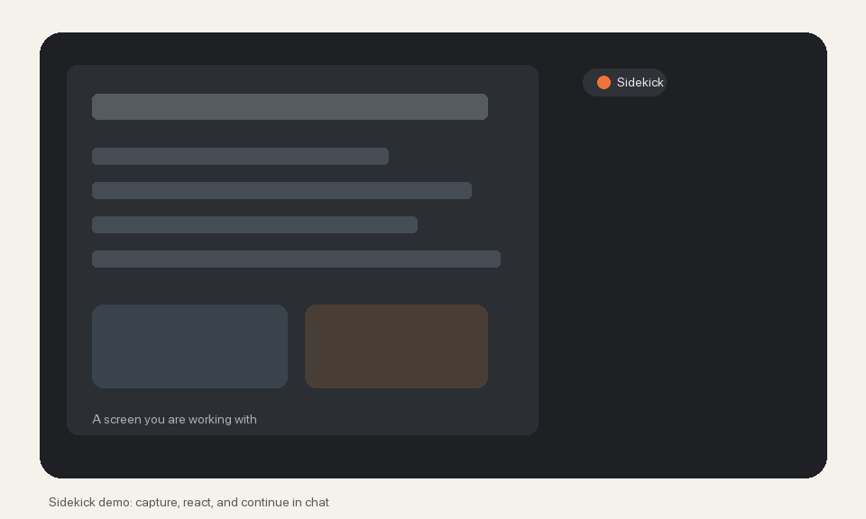

# Sidekick プロトタイプ

[English README](README.md)

`Sidekick` は macOS 向けのプロトタイプです。現在の画面をキャプチャし、`Vision` による OCR を実行し、その結果を LM Studio などの OpenAI 互換 API で公開されたローカル LLM に送って支援や伴走型フィードバックを返します。

## デモ



Sidekick が画面のすみで待機し、キャプチャ内容を読んで短い提案を返し、そのままチャットに広げるまでの動作イメージです。

## できること

- 画面のすみに小さなオーバーレイを置き、作業や視聴の流れを邪魔しない短いひとことを受け取れます。
- 画面にエラーや詰まりが見えたときは、次に試せそうなことをその場で提案します。
- 動画、配信、ゲーム、記事などを見ているときは、一緒に見ている相手のような軽い反応や小ネタを返せます。
- 気になったひとことは、そのまま同じオーバーレイ内でチャットに広げて深掘りできます。
- 直近のフィードバックを最大5件までさかのぼり、あとから気になった話題を再開できます。
- 普段は一定間隔でそっと画面を見守り、大きな変化があるときだけ少し具体的に反応します。
- 反応の強さを `Auto` / `Assist` / `Companion` / `Silent` で切り替えられます。
- 口調を落ち着いた感じ、友達っぽい感じ、静かめ、おしゃべり、小ネタありに調整できます。
- 前面ウィンドウだけ、またはディスプレイ全体を対象にできます。
- 画面画像、OCR テキスト、またはその両方を使ってローカルモデルに状況を伝えられます。
- UI の言語とモデルの返答言語を別々に選べます。
- endpoint やモデル名、プロンプト、監視間隔などの設定は次回起動時にも引き継がれます。

## 必要なもの

- macOS 14 以降
- Xcode の実行環境
- 実行ファイルに対する `画面収録` 権限
- LM Studio などの OpenAI 互換 chat completions API
  - 例: `http://127.0.0.1:1234/v1/chat/completions`
- 動作確認済みの LM Studio バージョン: `0.4.16+2 (0.4.16+2)`
- 動作確認済みのローカルモデル: LM Studio 経由の `Gemma4-26b-a4b`

## プライバシーとデータの扱い

Sidekick は画面内容を扱うアプリです。画面共有と同じくらい慎重に使ってください。

- キャプチャ画像と OCR テキストは、アプリに設定した API endpoint に送信されます。
- 既定 endpoint は LM Studio 用の localhost ですが、外部 endpoint に変えると画面内容がデバイス外へ送信される可能性があります。
- endpoint が localhost の場合でも、LM Studio や選択したモデル実行環境がツール、プラグイン、MCP サーバー、その他の連携を呼び出す設定になっていると、プロンプト、OCR テキスト、スクリーンショット、またはそこから派生した文脈の一部が外部サービスへ送信される可能性があります。
- 機密性の高い画面で Sidekick を使う前に、LM Studio 側のツール / MCP / プラグイン設定を確認し、信頼できる構成であることを確かめてください。
- キャプチャ画像は現在セッションと直近のアプリ内会話履歴のためにメモリ上で保持します。スクリーンショットのアーカイブとしてファイル保存はしません。
- 直近のフィードバックやチャット履歴はメモリ上のみで、アプリ終了時に消えます。
- 設定値と編集したプロンプトは `UserDefaults` に保存されます。
- ログは `~/Library/Logs/Sidekick/sidekick.log` と `/tmp/sidekick.log` に書き込まれます。
- 秘密情報、認証情報、個人的なメッセージ、顧客データなどが画面にある状態では、設定 endpoint を完全に信頼できる場合にだけ使ってください。

## 起動方法

```bash
swift run
```

最初のキャプチャ時に macOS から `画面収録` 権限の許可が求められます。許可後はアプリを再起動してから `Capture Screen`、`Ask Sidekick`、または `Start Monitoring` を実行してください。

## 簡易 .app / インストール用 DMG の作成

通知を使うには `swift run` ではなく `.app` バンドルとして起動する必要があります。簡易バンドルは次で作れます。

```bash
zsh Scripts/build_app.sh
open dist/Sidekick.app
```

`.app` 版で起動すると、通知まわりが有効になります。

ビルドスクリプトはリポジトリ内に `dist/Sidekick.app` を作り、ローカルで ad-hoc signing します。`/Applications` には自動インストールしません。必要なら手動で移動してください。

ドラッグ&ドロップでインストールできる DMG は次で作れます。

```bash
zsh Scripts/build_dmg.sh
open dist/Sidekick.dmg
```

DMG の中には `Sidekick.app` と `Applications` へのショートカットが入ります。一般的な macOS アプリと同じように、`Sidekick.app` を `Applications` へドラッグしてインストールできます。

## LM Studio の切り分け

画像入力で失敗する場合は、まず LM Studio 単体で API が通るか確認してください。

```bash
zsh Scripts/test_lmstudio_vision.sh <model-id> <image-path> [base-url]
```

例:

```bash
zsh Scripts/test_lmstudio_vision.sh google/gemma-3-4b-it ~/Desktop/capture.png http://127.0.0.1:1234/v1
```

このスクリプトは `GET /models`、`POST /v1/responses`、`POST /v1/chat/completions` を順に試します。どちらかだけ通る場合は、アプリ側の `API Format` をそれに合わせてください。

## 補足

- 起動するとまずオーバーレイが開き、`モニタリングを開始` で見守りを始められます。
- `モニタリングを開始` を押すと、指定間隔で定期キャプチャしてフィードバックします。
- オーバーレイでは、`チャットする` の右側にある矢印から直近5件のフィードバック履歴をたどれます。
- 履歴を見ている状態で `チャットする` を押すと、その時点の会話を再開します。
- 監視中のフィードバックは `通知` または `オーバーレイ` のどちらかに流せます。現在の主導線はオーバーレイです。
- ダッシュボードを閉じてもアプリは終了せず、メニューバーから再表示したりチャットを開いたりできます。
- オーバーレイ右上の `×` はオーバーレイを隠すのではなく、Sidekick 自体を終了します。
- 監視中は前回との差分を見て、変化が大きいときに具体的支援を増やし、変化が小さいときは短い伴走コメントや状況共有に寄せます。
- `Agent Mode` が `Auto` のときは、画面から `State` `Intent` `Response` を推定し、必要に応じて `assist` `companion` `celebrate` `silent` を切り替えます。
- `commentary` や `fun_fact` が選ばれると、一緒に画面を見ているような軽いコメントや短い背景知識・小ネタを返します。
- `Agent Mode` を `Assist` `Companion` `Silent` に固定すると、分類をスキップしてその反応方針を優先します。
- `Tone = 砕けた感じ` と `Companion Style = 小ネタあり` を使うと、友達っぽい軽いコメントや背景知識を出しやすくなります。
- 入力モードは `OCRのみ` `画像のみ` `OCR+画像` から選べます。Gemma 系の VLM を使う場合は `画像のみ` か `OCR+画像` が向いています。
- キャプチャ対象は `前面ウィンドウ` と `ディスプレイ全体` を切り替えられます。既定は `ディスプレイ全体` です。
- `API Format` は `Chat` と `Responses` を切り替えられます。LM Studio やモデルによって相性が違う場合の切り分けに使えます。
- 現在はメニューバー常駐も入っているので、ダッシュボードを閉じてもバックグラウンド監視を継続できます。
- 返答中にモデルが出した `---` のような Markdown 区切り線は、表示前に簡易的に除去しています。

## 開発

ローカルビルド:

```bash
swift build
```

GitHub Actions でも push と pull request に対して同じビルドを macOS 上で実行します。

## ライセンス

MIT。詳細は [LICENSE](LICENSE) を参照してください。
