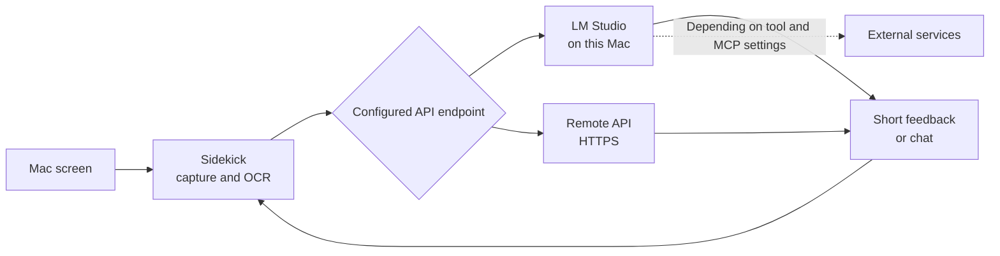

# Sidekick

[日本語 README](README.ja.md)

`Sidekick` is a desktop assistant that responds to what you are viewing on your Mac. It can suggest a next step when an error appears, react like someone watching alongside you during a video or game, and continue an interesting response as a chat with the current screen context.


## What It Does

- **Spot blocked work:** Read visible errors or settings and suggest a short next step.
- **Watch along with you:** Add reactions, relevant context, or small tidbits during videos and games.
- **Respond only when useful:** Wait quietly when little changes and let you tune response frequency and tone.
- **Continue in chat:** Open a conversation directly from an overlay response while retaining the current context.
- **Return to a recent topic:** Browse up to five recent feedback items and resume the selected conversation.

## How It Works



By default, screen context is sent to LM Studio on the same Mac. Screen data or derived context may leave the device if you configure a remote API or if LM Studio tools, plugins, or MCP servers use external services.

## Choose An Installation Method

> [!IMPORTANT]
> Sidekick builds on GitHub Releases are not signed with a Developer ID and are not notarized by Apple. Apple cannot verify the developer, whether the app was modified, or whether it contains known malware. Use a build only when you trust this repository and its distribution source.

The current release is [`v0.1.2`](https://github.com/ast-ry/sidekick/releases/tag/v0.1.2). Its DMG includes the latest security and privacy hardening, but it remains ad-hoc signed and unnotarized. Choose the DMG for a simpler installation, or build from source if you want to inspect and compile the code yourself.

### A. Use The GitHub Release DMG

Open the [`v0.1.2` release](https://github.com/ast-ry/sidekick/releases/tag/v0.1.2), review the release notes, and download both the DMG and its `.sha256` file. Open the DMG and drag `Sidekick.app` to `Applications`.

Verify the downloaded file before opening it:

```bash
cd ~/Downloads
shasum -a 256 -c Sidekick-0.1.2-unnotarized.dmg.sha256
```

If macOS blocks the app on first launch:

1. Try to open Sidekick once and confirm that macOS shows a warning.
2. Open `System Settings`.
3. Open `Privacy & Security`.
4. Choose `Open Anyway` for Sidekick.
5. Review the warning and open the app only if you trust it.

See Apple's official guide to [opening an app from an unidentified developer](https://support.apple.com/guide/mac-help/mh40616/mac). Disabling Gatekeeper or using `xattr` to remove quarantine in bulk is not recommended.

A matching SHA-256 confirms file identity. It is not a substitute for Apple code signing or malware scanning.

### B. Build From Source

Requirements:

- macOS 14 or later
- Xcode or Xcode Command Line Tools
- Git
- LM Studio or another OpenAI-compatible API

```bash
git clone https://github.com/ast-ry/sidekick.git
cd sidekick
zsh Scripts/build_app.sh
open dist/Sidekick.app
```

This creates `dist/Sidekick.app`. A local build is also not Developer ID signed or notarized by Apple.

## Runtime Requirements

Both release and source-built versions require:

- macOS 14 or later
- Screen Recording permission
- LM Studio or another OpenAI-compatible API
- Confirmed LM Studio version: `0.4.16+2 (0.4.16+2)`
- Confirmed model setup: `Gemma4-26b-a4b` through LM Studio

## Prepare LM Studio

1. Launch LM Studio and download or select `Gemma4-26b-a4b`.
2. Load the model in the local server view.
3. Start the OpenAI-compatible API server.
4. Confirm that the server URL is `http://127.0.0.1:1234/v1`.
5. Confirm that the model can respond to image input.

Sidekick's default endpoint is `http://127.0.0.1:1234/v1/chat/completions`. Plain HTTP is accepted only for localhost and loopback addresses. Remote endpoints must use HTTPS.

## Configure Sidekick

Launch the app and choose `Open Settings` from the menu bar item, or open the dashboard.

1. In `Connection`, set `Base URL` to the LM Studio endpoint.
2. Set `Model` to the model loaded in LM Studio.
3. Start with `API Format` set to `Chat`. Switch to `Responses` if that is the only format supported by your setup.
4. Choose the interface and output languages.
5. In `Behavior`, choose `Image only` or `OCR + Image` for `Analysis Mode`.
6. Start with `Capture Scope` set to `Entire Display`. Use `Frontmost Window` to limit capture to the active app.
7. In `Diagnostics`, use `Capture Screen` and confirm that a preview appears.
8. Use `Ask Sidekick` and confirm that LM Studio returns a response.
9. Select `Start Monitoring` when the checks pass.

macOS requests Screen Recording permission on the first capture. Relaunch Sidekick after granting it.

## Privacy And Data Handling

Treat Sidekick with the same care as screen sharing.

- Screenshots and OCR text are sent to the configured API endpoint.
- A remote endpoint sends screen contents off-device.
- Even on localhost, LM Studio tools, plugins, MCP servers, or model runtimes may send information externally.
- Captures are held in memory for the current session and recent conversation context. Sidekick does not create a screenshot archive.
- Feedback and chat history are lost when the app quits.
- Settings and edited prompts are persisted with `UserDefaults`.
- Logs are stored at `~/Library/Logs/Sidekick/sidekick.log` with user-only permissions and size-based rotation.
- Notification previews do not display model-generated response text.
- Avoid sensitive screens unless you trust the complete endpoint, model, tool, plugin, and MCP configuration.

## Troubleshooting

### Screen capture does not work

Allow Sidekick under `System Settings` → `Privacy & Security` → `Screen Recording`, then relaunch the app.

### Sidekick cannot reach LM Studio

- Confirm that the LM Studio local server is running.
- Match Sidekick's `Base URL` to the LM Studio host and port.
- Use HTTPS for remote endpoints.

### Image input does not work

Test LM Studio separately:

```bash
zsh Scripts/test_lmstudio_vision.sh <model-id> <image-path> [base-url]
```

The script checks `GET /models`, `POST /v1/responses`, and `POST /v1/chat/completions`. Match Sidekick's `API Format` to a format that works.

## Development

```bash
swift build
swift test
```

GitHub Actions runs tests for pushes and pull requests. Use `Scripts/build_app.sh` for a local app and `Scripts/build_dmg.sh` for an unnotarized DMG. The DMG filename includes `unnotarized`, and the script also creates a SHA-256 file.

`Scripts/build_release.sh` remains available for a future Developer ID signed and notarized release if the project joins the Apple Developer Program. It is not part of the current user distribution path.

## Security

Do not report vulnerabilities in a public issue. See [SECURITY.md](SECURITY.md) for the private reporting method and supported versions.

## License

MIT. See [LICENSE](LICENSE).
