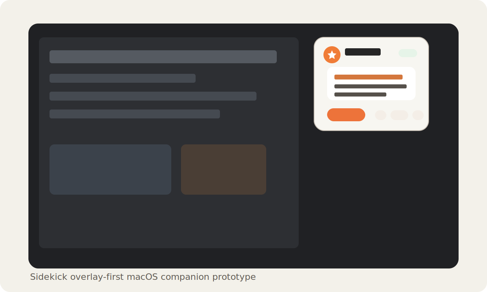

# Sidekick Prototype

[日本語 README](README.ja.md)

`Sidekick` is a macOS prototype that captures the current screen, extracts OCR text with Vision, and sends the result to a local LLM exposed through an OpenAI-compatible API such as LM Studio for both task support and companion-style feedback.



## Demo


This is an illustrative demo of the main loop: Sidekick watches quietly, captures the current screen, returns a short suggestion, and lets you continue in chat.

## What It Does

- Keeps a small overlay at the edge of your screen for short, low-friction reactions while you work, browse, watch, or play.
- Notices visible errors or signs of being stuck and suggests a next step without forcing you into a full chat.
- Can react like someone watching alongside you, with light commentary or short relevant tidbits for videos, streams, games, articles, and other screen content.
- Lets you expand any interesting feedback item into a chat inside the same overlay.
- Keeps up to five recent feedback items so you can browse back and resume a topic later.
- Monitors quietly on an interval and becomes more concrete when the screen changes meaningfully.
- Lets you choose how assertive it should be with `Auto`, `Assist`, `Companion`, and `Silent` modes.
- Lets you tune the voice from calm to casual, quiet to chatty, or more tidbit-oriented.
- Can focus on the frontmost window or the entire display.
- Can use screenshots, OCR text, or both as context for a local model.
- Separates the app UI language from the model response language.
- Remembers endpoint, model, prompts, monitoring interval, and other settings across launches.

## Requirements

- macOS 14 or later
- Xcode app runtime components installed
- Screen Recording permission enabled for the built executable
- LM Studio running with an OpenAI-compatible chat completions endpoint, for example `http://127.0.0.1:1234/v1/chat/completions`
- Confirmed LM Studio version: `0.4.16+2 (0.4.16+2)`
- Confirmed local model setup: `Gemma4-26b-a4b` through LM Studio

## Privacy And Data Handling

Sidekick is screen-aware software. Use it with the same care you would use for screen sharing.

- Captured screenshots and OCR text are sent to the API endpoint configured in the app.
- The default endpoint is localhost for LM Studio, but changing it to a remote endpoint can send screen contents off-device.
- Even with a localhost endpoint, LM Studio or the selected model runtime may be configured to call tools, plugins, MCP servers, or other integrations. Those integrations can forward parts of the prompt, OCR text, screenshots, or derived context to external services depending on their configuration.
- Review and trust your LM Studio tool/MCP/plugin configuration before using Sidekick with sensitive screen contents.
- Captured screenshots are kept in memory for the current session and recent in-app conversation history. They are not written to a screenshot archive.
- Recent feedback/chat history is held in memory and is lost when the app quits.
- Settings and editable prompts are persisted with `UserDefaults`.
- Logs are written to `~/Library/Logs/Sidekick/sidekick.log` and `/tmp/sidekick.log`.
- Avoid using Sidekick on screens containing secrets, credentials, private messages, customer data, or other sensitive information unless you fully trust the configured endpoint.

## Run

```bash
swift run
```

On first capture, macOS should prompt for Screen Recording permission. After granting it, relaunch the app and try `Capture Screen`, `Ask Sidekick`, or `Start Monitoring`.

## Build A Simple .app Or Installer DMG

Notifications need the app to run from an `.app` bundle instead of `swift run`. You can create a simple local bundle with:

```bash
zsh Scripts/build_app.sh
open dist/Sidekick.app
```

When launched from the `.app`, notification support can be enabled.

The build script creates `dist/Sidekick.app` inside this repository and ad-hoc signs it locally. It does not install into `/Applications`; move it manually if you want that.

To create a drag-and-drop installer disk image:

```bash
zsh Scripts/build_dmg.sh
open dist/Sidekick.dmg
```

The DMG contains `Sidekick.app` and an `Applications` shortcut. Drag `Sidekick.app` onto `Applications` to install it like a typical macOS app.

## LM Studio Troubleshooting

If image input fails, verify LM Studio directly first:

```bash
zsh Scripts/test_lmstudio_vision.sh <model-id> <image-path> [base-url]
```

Example:

```bash
zsh Scripts/test_lmstudio_vision.sh google/gemma-3-4b-it ~/Desktop/capture.png http://127.0.0.1:1234/v1
```

The script checks `GET /models`, `POST /v1/responses`, and `POST /v1/chat/completions`. If only one works, match the app's `API Format` to that endpoint style.

## Notes

- On launch, the app opens into the overlay first, and `Start Monitoring` begins the companion loop.
- `Start Monitoring` captures on a timer and generates feedback automatically.
- In overlay mode, you can browse up to five recent feedback items with the arrows beside the primary action button.
- While browsing an older item, pressing `Chat` resumes that historical conversation in-place.
- Monitoring feedback can be delivered through either notifications or the overlay. The current primary UX is overlay-first.
- You can close the dashboard window and keep the app alive in the menu bar.
- The `x` button in the overlay quits the entire app rather than hiding only the overlay.
- During monitoring, larger changes lead to more concrete suggestions, while smaller changes lead to brief check-ins.
- In `Agent Mode = Auto`, the app estimates `State`, `Intent`, and `Response` before deciding whether to speak.
- `commentary` and `fun_fact` responses are used for co-viewing style reactions and short relevant context or fun tidbits when appropriate.
- `Agent Mode = Assist`, `Companion`, or `Silent` skips classification and pins the response style.
- `Tone = casual` with `Companion Style = fun-fact` is the best fit if you want it to feel like a friend watching the screen with you.
- You can choose `OCR only`, `Image only`, or `OCR + Image`. For VLMs such as Gemma, `Image only` or `OCR + Image` is usually the better fit.
- You can switch the capture target between the frontmost window and the full display. The default is the full display.
- `API Format` can be switched between `Chat` and `Responses` for compatibility testing with different LM Studio builds and model wrappers.
- The current build already includes a menu bar entry so the app can stay around quietly while the dashboard is closed.
- Markdown-style separators such as `---` are stripped from model replies before rendering.

## Development

Build locally:

```bash
swift build
```

GitHub Actions runs the same build on macOS for pushes and pull requests.

## License

MIT. See [LICENSE](LICENSE).
