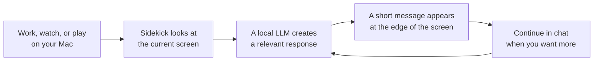

# Sidekick Prototype

[日本語 README](README.ja.md)

`Sidekick` is a desktop assistant that responds to what you are currently viewing on your Mac. It can suggest a next step when an error appears, react like someone watching alongside you during a video or game, and continue any interesting response as a chat.

Screen understanding is provided by a local LLM running through LM Studio or another OpenAI-compatible endpoint.

## Download

Download the latest DMG from [GitHub Releases](https://github.com/ast-ry/sidekick/releases/latest), or use the direct download link:

[Download Sidekick.dmg](https://github.com/ast-ry/sidekick/releases/latest/download/Sidekick.dmg)

Open the DMG and drag `Sidekick.app` to `Applications`. Sidekick is an early prototype and is currently ad-hoc signed, so macOS may show a security warning on first launch.

## Demo


Sidekick waits at the edge of the screen, provides a short response that fits the situation, and lets you continue that topic in chat.

## How It Works



With the default setup, screen context is sent to LM Studio running on the same Mac. If you configure a remote API instead, screen information may leave your device.

## What It Does

Here are some typical ways to use it:

- **When work gets stuck:** Sidekick can read visible errors, settings screens, or signs of a blocked workflow and suggest a short next step.
- **While watching or playing:** It can add reactions, relevant background context, or small tidbits like someone watching alongside you.
- **While you are focused:** It can wait quietly when little is changing and respond only when something looks worth mentioning.
- **When you want more detail:** Continue directly from an overlay response into a chat that keeps the current screen context.
- **When you want to revisit something:** Browse up to five recent feedback items and resume the selected topic.

You can tune the experience with `Auto`, `Assist`, `Companion`, and `Silent` modes, as well as tone, response frequency, capture scope, screenshot/OCR input, and output language.

## Requirements

- macOS 14 or later
- Xcode app runtime components installed
- Screen Recording permission enabled for the built executable
- LM Studio running with an OpenAI-compatible chat completions endpoint, for example `http://127.0.0.1:1234/v1/chat/completions`
- Confirmed LM Studio version: `0.4.16+2 (0.4.16+2)`
- Confirmed local model setup: `Gemma4-26b-a4b` through LM Studio

## LM Studio Setup Example

The confirmed setup uses LM Studio `0.4.16+2 (0.4.16+2)` with `Gemma4-26b-a4b` loaded and the OpenAI-compatible API server running on localhost.

1. Launch LM Studio and download or select `Gemma4-26b-a4b`.
2. Load the model in LM Studio's local server view.
3. Start the OpenAI-compatible API server.
4. Confirm that the server URL is `http://127.0.0.1:1234/v1`.
5. Confirm that the loaded model can respond with image input. If it does not work, use the script in "LM Studio Troubleshooting" below to check whether `Responses` or `Chat Completions` works in your setup.

Sidekick's default endpoint is `http://127.0.0.1:1234/v1/chat/completions`. If you change the host or port in LM Studio, update `Base URL` in Sidekick to match it.

## Sidekick Settings After Launch

After launching the app, open `Open Settings` from the Sidekick menu bar item, or open the dashboard and configure these fields.

1. Open `Connection`.
2. Set `Base URL` to the LM Studio endpoint. Usually this is `http://127.0.0.1:1234/v1/chat/completions`.
3. Set `Model` to the model name loaded in LM Studio. In the confirmed setup, use `Gemma4-26b-a4b`.
4. Set `API Format` to `Chat` first. If the troubleshooting script shows that only `Responses` works, switch it to `Responses`.
5. Set `Interface Language` and `Output Language` to `Japanese` or `English` as needed.
6. Open `Behavior` and set `Analysis Mode` to `Image only` or `OCR + Image`. These are usually the best fit for Gemma VLM setups.
7. Leave `Capture Scope` as `Entire Display` for the first test. Switch to `Frontmost Window` if you only want Sidekick to see the active app window.
8. Open `Diagnostics` and click `Capture Screen` to confirm that a preview appears.
9. Click `Ask Sidekick` and confirm that LM Studio returns a response.
10. If that works, click `Start Monitoring`.

macOS Screen Recording permission is required on the first capture. After granting permission, relaunch Sidekick and try `Capture Screen` or `Ask Sidekick` again.

## Privacy And Data Handling

Sidekick is screen-aware software. Use it with the same care you would use for screen sharing.

- Captured screenshots and OCR text are sent to the API endpoint configured in the app.
- The default endpoint is localhost for LM Studio, but changing it to a remote endpoint can send screen contents off-device.
- Even with a localhost endpoint, LM Studio or the selected model runtime may be configured to call tools, plugins, MCP servers, or other integrations. Those integrations can forward parts of the prompt, OCR text, screenshots, or derived context to external services depending on their configuration.
- Review and trust your LM Studio tool/MCP/plugin configuration before using Sidekick with sensitive screen contents.
- Captured screenshots are kept in memory for the current session and recent in-app conversation history. They are not written to a screenshot archive.
- Recent feedback/chat history is held in memory and is lost when the app quits.
- Settings and editable prompts are persisted with `UserDefaults`.
- Logs are written to `~/Library/Logs/Sidekick/sidekick.log` and `/tmp/sidekick.log`.
- Avoid using Sidekick on screens containing secrets, credentials, private messages, customer data, or other sensitive information unless you fully trust the configured endpoint.

## Run

```bash
swift run
```

On first capture, macOS should prompt for Screen Recording permission. After granting it, relaunch the app and try `Capture Screen`, `Ask Sidekick`, or `Start Monitoring`.

## Build A Simple .app Or Installer DMG

Notifications need the app to run from an `.app` bundle instead of `swift run`. You can create a simple local bundle with:

```bash
zsh Scripts/build_app.sh
open dist/Sidekick.app
```

When launched from the `.app`, notification support can be enabled.

The build script creates `dist/Sidekick.app` inside this repository and ad-hoc signs it locally. It does not install into `/Applications`; move it manually if you want that.

To create a drag-and-drop installer disk image:

```bash
zsh Scripts/build_dmg.sh
open dist/Sidekick.dmg
```

The DMG contains `Sidekick.app` and an `Applications` shortcut. Drag `Sidekick.app` onto `Applications` to install it like a typical macOS app.

## LM Studio Troubleshooting

If image input fails, verify LM Studio directly first:

```bash
zsh Scripts/test_lmstudio_vision.sh <model-id> <image-path> [base-url]
```

Example:

```bash
zsh Scripts/test_lmstudio_vision.sh google/gemma-3-4b-it ~/Desktop/capture.png http://127.0.0.1:1234/v1
```

The script checks `GET /models`, `POST /v1/responses`, and `POST /v1/chat/completions`. If only one works, match the app's `API Format` to that endpoint style.

## Notes

- On launch, the app opens into the overlay first, and `Start Monitoring` begins the companion loop.
- `Start Monitoring` captures on a timer and generates feedback automatically.
- In overlay mode, you can browse up to five recent feedback items with the arrows beside the primary action button.
- While browsing an older item, pressing `Chat` resumes that historical conversation in-place.
- Monitoring feedback can be delivered through either notifications or the overlay. The current primary UX is overlay-first.
- You can close the dashboard window and keep the app alive in the menu bar.
- The `x` button in the overlay quits the entire app rather than hiding only the overlay.
- During monitoring, larger changes lead to more concrete suggestions, while smaller changes lead to brief check-ins.
- In `Agent Mode = Auto`, the app estimates `State`, `Intent`, and `Response` before deciding whether to speak.
- `commentary` and `fun_fact` responses are used for co-viewing style reactions and short relevant context or fun tidbits when appropriate.
- `Agent Mode = Assist`, `Companion`, or `Silent` skips classification and pins the response style.
- `Tone = casual` with `Companion Style = fun-fact` is the best fit if you want it to feel like a friend watching the screen with you.
- You can choose `OCR only`, `Image only`, or `OCR + Image`. For VLMs such as Gemma, `Image only` or `OCR + Image` is usually the better fit.
- You can switch the capture target between the frontmost window and the full display. The default is the full display.
- `API Format` can be switched between `Chat` and `Responses` for compatibility testing with different LM Studio builds and model wrappers.
- The current build already includes a menu bar entry so the app can stay around quietly while the dashboard is closed.
- Markdown-style separators such as `---` are stripped from model replies before rendering.

## Development

Build locally:

```bash
swift build
```

GitHub Actions runs the same build on macOS for pushes and pull requests.

## License

MIT. See [LICENSE](LICENSE).
